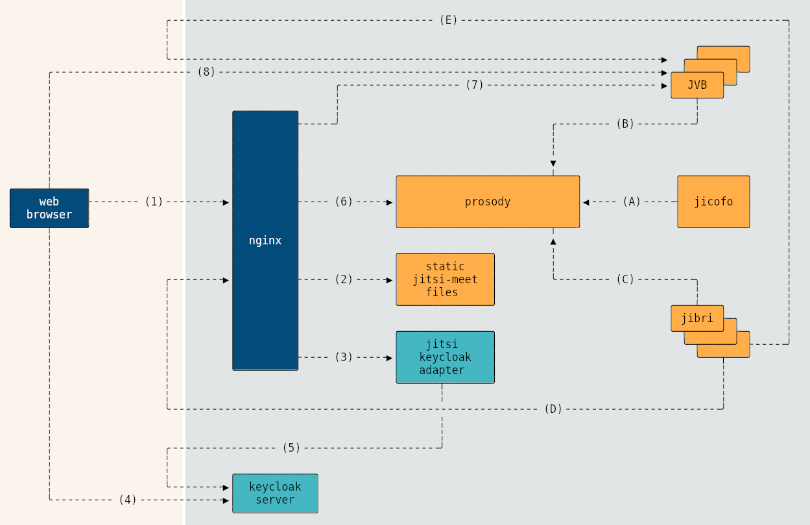

# Communication Pipelines

### (1) Web browser - Nginx

- Protocol: `HTTPS`
- Port: `TCP/443`
- Connection types:
  - stateless, non-persistent for UI, static files, etc.
  - persistent for websockets
- Proxied traffics:
  - Publishing static `jitsi-meet` files\
    _(1) >> (2)_
  - Accessing `jitsi-keycloak-adapter`\
    _(1) >> (3)_
  - Accessing `prosody` via `xmpp-websocket` or `bosh`\
    _(1) >> (6)_
  - Signaling via `colibri-websocket`\
    _(1) >> (7)_

### (2) Nginx - Jitsi-meet

- Protocol: direct file access
- Data: static files such as `HTML`, `javascript` files (_output_)

### (3) Nginx - Jitsi-keycloak-adapter

- Protocol: `HTTP`
- Port: `TCP/9000`
- Proxied: yes
- Data:
  - Short-term Keycloak authorization code (_input_)
  - Generated Jitsi token (_output_)

### (4) Web browser - Keycloak

- Protocol: `HTTPS`
- Port: `TCP/443`
- Data: out of our scope

### (5) Jitsi-keycloak-adapter - Keycloak

- Protocol: `HTTPS`
- Port: `TCP/443`
- Data:
  - Short-term Keycloak authorization code (_output_)
  - User info such as `username`, `email`, etc. (_input_)

### (6) Nginx - Prosody

- Protocol: `HTTP`
- Port: `TCP/5280`
- Proxied: yes
- Connection type: web-based `XMPP` with `BOSH` or `websocket` depending on the
  configuration.
- Data: XML messages

### (7) Nginx - JVB

- Protocol: `HTTP`
- Port: `TCP/9090`
- Proxied: yes
- Connection type: `websocket`
- Data: signaling for media traffic

### (8) Web client - JVB

- Protocol: `DTLS-SRTP`
- Port: `UDP/10000` by default
- Data: audio/video (_bidirectional_)

### (A) Jicofo - Prosody

- Protocol: `XMPP` with `TLS`
- Port: `TCP/5222`

### (B) JVB - Prosody

- Protocol: `XMPP` with `TLS`
- Port: `TCP/5222`

### (C) Jibri - Prosody

- Protocol: `XMPP` with `TLS`
- Port: `TCP/5222`

### (D) Jibri - Nginx

The headless `Chrome` of `Jibri` uses this pipeline. So, it works like a normal
"_web browser - JVB_" connection _(1)_.

- Protocol: `HTTPS`
- Port: `TCP/443`
- Connection types:
  - stateless, non-persistent for UI, static files, etc.
  - persistent for websockets

### (E) Jibri - JVB

The headless `Chrome` of `Jibri` uses this pipeline. So, it works like a normal
"_web browser - JVB_" connection _(8)_.

- Protocol: `DTLS-SRTP`
- Port: `UDP/10000` by default
- Data: audio/video (_input_)
